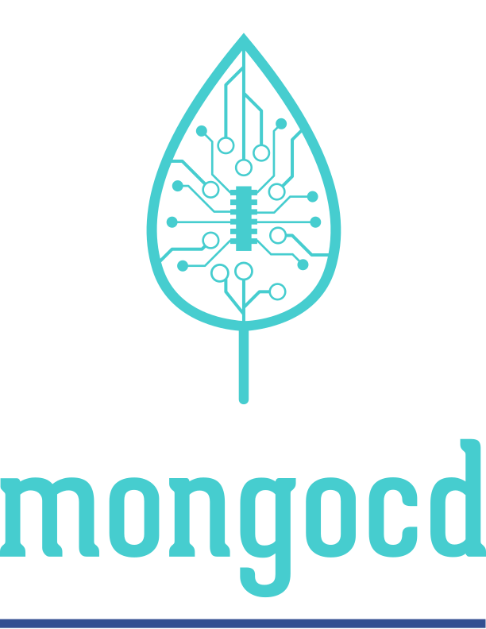
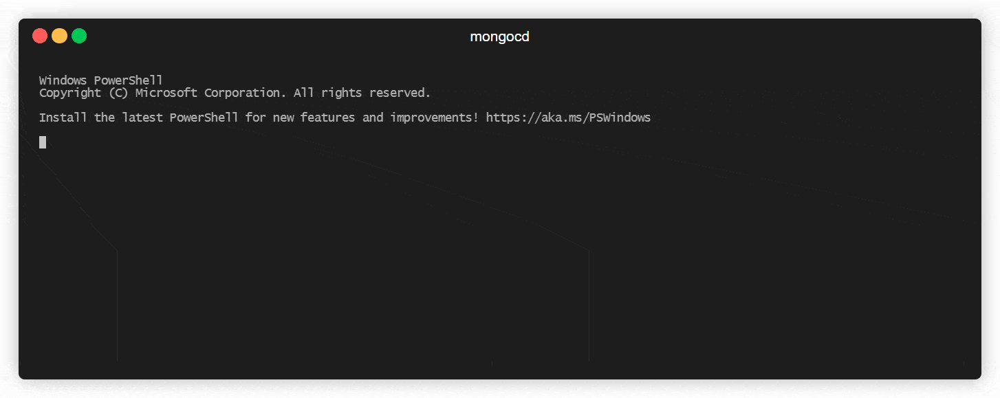
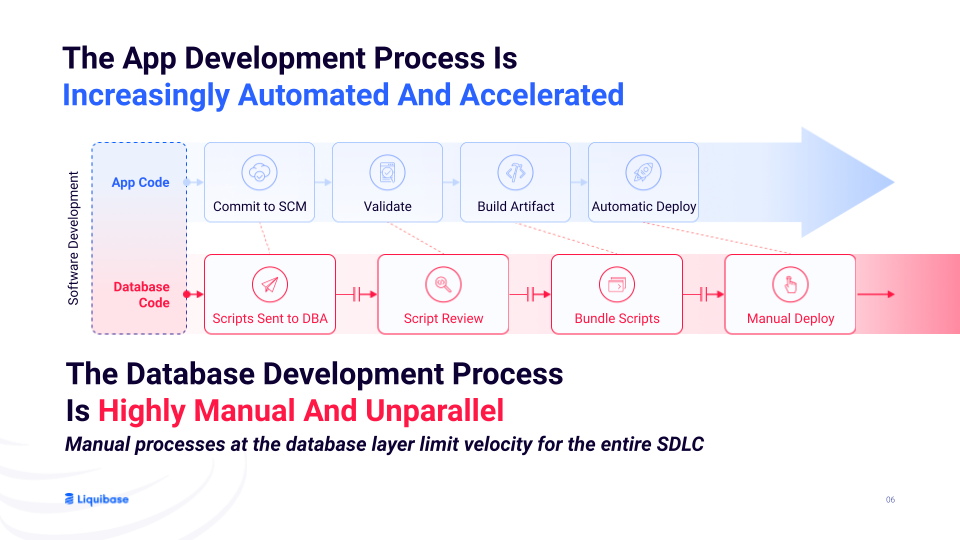

<!--  -->

<p align="center">
    <br>
        
	<br>
    gitops style source to destination data management for mongodb.
</p>

[](https://github.com/hayone1/MongoPrismSync/actions/workflows/main.yml)

## Table of Contents
- [Description](#description)
- [Features](#features)
- [Installation](#installation)
- [Usage](#usage)
- [Examples](#examples)
- [Defaults](#defaults)
- [Case in point](#caseinpoint)
- [License](#license)

## Description
mongocd is a simple command line tool that enables you to extract documents from a source db(eg. Test), apply transformations in a granular and flexible way, then generate code that can ensure a destination db/collection/document is in sync with the transformed data.

It is built loosely around kubernetes and gitops concepts.

<center>
    
</center>

## Features
- Data GitOps ‍🔄

    - Manage data similar to code, using Git for version control and collaboration.

- Declarative Data Transformation 📄
    - Define how data should be extracted and transformed using simple and expressive configurations.

- Auditable Data History 📚
    - Track changes, revert to previous versions, and ensure data consistency across environments.

- Integrates with Existing Tools 🛠️
    - Uses and integrates with python and mongosh.


## Installation
- WIP

## Usage
**Set Environment Variables**
``` bash
export MONGOSOURCEPASSWORD="YourMongoSourcePassword"
export CONFIGFOLDER="YourMongcdWorkingFolder"
```
or
``` pwsh
$env:MONGOSOURCEPASSWORD="YourMongoSourcePassword"
$env:CONFIGFOLDER="YourMongcdWorkingFolder"
```
- WIP

### Weave
- WIP
### Apply
- WIP

## Examples
- WIP

## Defaults
WIP

## Case in point
You have a new pre-prod environment you just setup up. Perhaps it runs on linux machines or a shiny kubernetes flavour.

You've got a nice ci pipeline setup with github actions, gitlab ci or something equally capable. 
You also have a well structured release pipeline empowered by argocd, fluxcd, fleet, kpt or something else.

You have many tools in-between that eases and automates observability, alerting, testing, reporting, feedbacks and a lot more. It's a beautiful web of tools. You've even got internal developer platforms to empower the dev in DevOps. You can sleep both day and night knowing all is well with your SDLC and SLI.

This makes things easy and fast. You even have internal developer platforms to enable developers take part in this sweet web on automation you have spun and you've gotten a cultural buy-in of your team on the beautiful benefits of DevOps.

While dreaming though, something occassionally bugs your beautiful techno dreams. You try to ignore it like a glitch sometimes but it is consistent. It's the last mile of your almost perfect pipeline. It's the **DevOps that could have been in your data.**

The glitched dream goes like this:
 Source: https://www.liquibase.com/

At this point, It looks like i've moved from a readme to a whitepaper 😂. But you can find those [here](https://learn.g2.com/database-devops) and [here](https://www.liquibase.com/resources/guides/database-automation).

### Enter Mongocd

Mongocd aims to contribute and integrate to the various database devops and release automation solutions being developed to this speed killing dream glitch. You can integrate mongocd when:

- You have a existing mongodb cluster (likely a test one where interations happen very quickly) and you only want to synchronize only specific databases or collections or documents to a destination environment.
- You want to apply some data transformations to specific documents or a group of documents in a predictble way before synchronizing it to the destination database.
- You want to leverage the existing access governance in your scm/repo in managing certain aspects of your destination database.
- You want to leverage the auditing and version control capabilities of your scm/repo in your data, knowing who requested what change and where the change affects. Then if required, roll back to a previous iteration of your data.

### Things to note
- You shouldn't manage massive data (eg. userinfo, session info, passwords etc...) in your repo. That's what the database is for. Rather you should manage things like schema definition and configuration related data; Things that will generally persist among environments or only need minimal data transformation across.
- If you manually change the data in the repo, mongocd will not know and the next time it is run, it will overwrite your manual changes. Hence any manual changes done to the data should be "translated" into the `WeaveConfig` in a way that can product the same outcome. That will prevent conflict and the need for constant manual interventions.

## TODO
- Weave should check if the current files have been manually edited before proceeding to adjust
- in debug mode, it should be apparent when a default value is being used for a field

### Ideas
Final name of the product couls be mongocd or mongoci or mongocd

## License
- WIP
