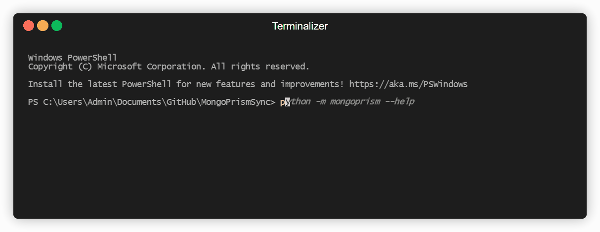

<!--  -->

     
        
	 
    A tool for generating mongodocuments a code from a source database.

## Description
mongocd is a simple command line tool that enables you to extract documents from a source db(eg. Test), apply transformations in a granular and flexible way, then generate code that can ensure a destination db/collection/document is in sync with the transformed data.

It is built loosely around kubernetes and gitops concepts.

    

## Install

Not Released yet
### Weave/Plan

### Apply

### Ideas
Final name of the product couls be mongoprism or mongoci or mongocd
